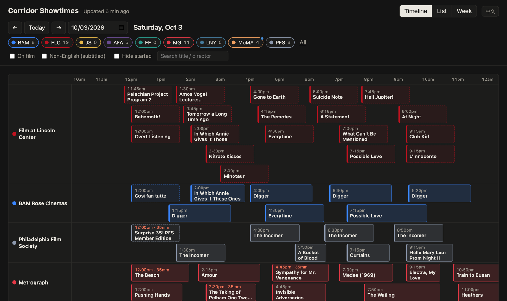
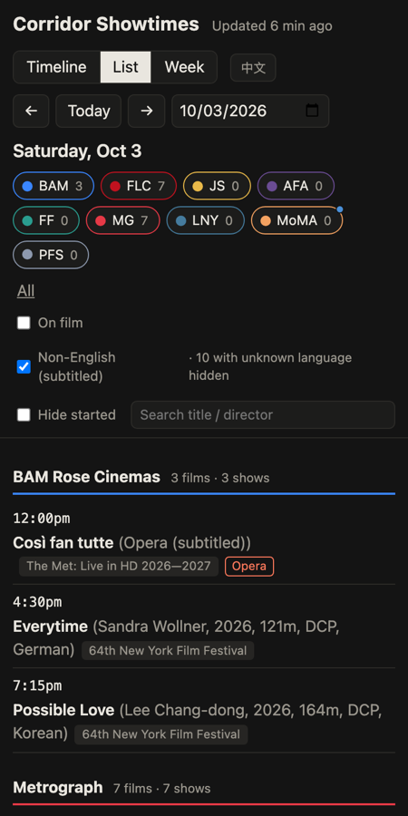

# Corridor Showtimes

**Showtimes from the cinemas you follow, on one timeline — starting with ten art-house and repertory cinemas from New York to Philadelphia.**

**Live site → https://marc506.github.io/corridor-showtimes/** · [中文说明](README.zh-CN.md)

Corridor Showtimes aggregates the calendars of art-house and repertory cinemas. The public instance
follows ten along the Northeast Corridor: Metrograph, Film Forum, Film at Lincoln Center, Anthology Film Archives, BAM,
MoMA, Japan Society, L'Alliance New York, the Philadelphia Film Society and Landmark's Ritz Five. It refreshes twice a
day and shows the day as a timeline, so you can answer *"what can I see tonight, and when?"* at a
glance. It was built as a faster, customizable alternative to existing listings sites, which
often lag behind the cinemas' own schedules.

**Want your own cinemas?** You don't need to know how to code: download this project and an AI coding
assistant adds them on your computer, usually in 10–20 minutes. See
[Add your own cinemas](#add-your-own-cinemas).



| | |
|---|---|
|  | **Views.** Timeline (a lane per screen, block width = runtime), list, and week grid.<br><br>**Filters.** Cinemas, *on film* (16/35/70mm), *subtitled / captioned*, *hide started*, and title/director/series search, which lists every matching screening from today on, day by day. All state lives in the URL, so every view is shareable.<br><br>**Mobile.** On narrow screens the timeline flips vertical. The page is also an installable home-screen app.<br><br>**Honest data.** Each cinema shows whether its data is fresh, stale (last good copy kept), or came from the fallback source. |

## Add your own cinemas

The public site only follows the author's cinemas. You can have your own copy with any US cinemas you
like, on your own computer — free, no coding. An AI coding assistant does the technical part; you answer
a few questions, and the whole thing takes about 20 minutes.

### What you need

- A computer (Mac, Windows or Linux).
- An **AI assistant that can run programs on your computer**: [Claude Code](https://claude.com/claude-code)
  (has a desktop app), [Cursor](https://cursor.com) or [Codex](https://openai.com/codex). Chat-only
  assistants — the ChatGPT or Claude websites, for example — can't do this: they can't install anything
  or open the cinema's website.
- The name of the cinema and the web page that lists its showtimes.

### Steps

1. **Download the project.** On this project's GitHub page
   (<https://github.com/Marc506/corridor-showtimes>), click the green **Code** button, then
   **Download ZIP**. Double-click the downloaded file to unzip it; you get a folder called
   `corridor-showtimes-main`. (Mac users: move the folder to your home folder, not Downloads / Documents /
   Desktop / iCloud Drive — macOS blocks daily automatic updates there.)
2. **Open the folder in your AI assistant.** Claude Code desktop / Cursor: *Open folder* and choose it.
   Terminal-based assistants: `cd` into the folder and start the assistant there.
3. **Send it this message:**

   > Please read AGENTS.md in this folder and help me add a cinema.

   (`AGENTS.md` is a set of instructions written for AI assistants; it tells yours exactly what to do.)
4. **Answer its questions** (see below). The first time it installs a few things, which takes a few
   minutes.
5. **Look at the result.** When it finishes it opens the page (`site/index.html`) in your browser, with
   your cinema's button at the top.
6. **Turn on automatic updates.** At the end it asks whether to update the showtimes every day; say yes.
   From then on they refresh at 01:00 and 13:00 whenever your computer is on.

### What the assistant will say, and how to answer

| It says something like… | You answer |
|---|---|
| "What's the cinema's name, the page that lists its showtimes, and which city is it in?" | e.g. *Nitehawk Williamsburg, https://nitehawkcinema.com/williamsburg/, Brooklyn*. Copy the address from your browser's address bar. |
| "Can I run this command?" / "Allow …?" | Allow. The commands install Python packages into this folder and read the cinema's website. |
| "I need to install a tool called uv (or Python) — OK?" | Yes. |
| "Found N showtimes, the first is …" | Nothing to do — that's success. |
| "Shall I set it to update automatically every day?" | Yes. (Or ask for other times, e.g. "every morning at 8".) |
| "This cinema's website has its own layout, I'll write a reading rule for it" | Wait a few minutes; it's writing and testing it. |
| "The website blocks automated access (Cloudflare …)" | That cinema can't be added automatically, and this project never works around such protection. New York and San Francisco cinemas can sometimes use another source — the assistant will offer it. |
| "I found no showtimes on that page" | Give it the page that actually lists the showtimes (look for "Calendar", "Showtimes" or "Now playing" on the cinema's site). |

### Afterwards

- Everything lives **on your computer**; the public website doesn't change.
- Once automatic updates are on, **every** cinema (including ones you add later) updates every day at
  01:00 and 13:00 while your computer is on; a run missed while it slept happens when it wakes. For an
  update right now, tell the assistant *"update the showtimes"*; to check or stop, ask *"are automatic
  updates on?"* / *"turn off automatic updates"*. The page header shows when data last changed.
- To add another cinema, send the same message again. To hide the author's cinemas, click their buttons
  at the top of the page (it remembers), or ask the assistant to switch them off.

### If it doesn't work

[Open an issue on GitHub](https://github.com/Marc506/corridor-showtimes/issues/new?template=help-add-cinema.yml)
(a free account is needed) with the cinema's name, its showtimes URL, which assistant you used and what
it said last. The assistant can write that text for you — ask it to.

## How it works

```
 scraper.schedule (launchd / Task Scheduler / systemd, 01:00 & 13:00) → scraper.update
        │
        ▼
 scraper.run ── per venue: fetch → parse → validate ──┐   failure? keep last good data,
        │          (JSON API / HTML / browser / feed)  │   or fall back to screenslate
        │                                              ▼
        │                    language + director enrichment (site text → TMDB → default)
        ▼
   SQLite ──► export ──► site/data.js ──► publish.sh ──► gh-pages ──► GitHub Pages
```

* **Python 3.12 scrapers**, one file per cinema behind a small registry. Every source separates
  `fetch()` (network) from `parse()` (pure), so all parsers are tested offline against real captured pages.
* **SQLite** keeps history. A successful scrape replaces only that venue's future rows; a failed one
  leaves them alone and marks the venue *stale*.
* **Static frontend**: vanilla JS, no framework or build step. It reads a generated `data.js`, so
  it works from `file://` as well as GitHub Pages.
* **Publishing**: after each run, the page and fresh data are force-pushed to `gh-pages` as a single
  orphan commit, so twice-daily updates never grow the repository.

## Sources, and the problems each one posed

| Cinema | Source | Notes |
|---|---|---|
| BAM | Undocumented calendar JSON API | Director, runtime, and language enriched from film pages (cached 7 days) |
| Film at Lincoln Center | The API behind their site | The website is behind Cloudflare; the API isn't. NYFF / Met Opera series inferred from presale metadata |
| Japan Society | WordPress custom endpoint | Series containers vs. single screenings |
| Anthology Film Archives | Server-rendered HTML, month by month | One listing can hold several showtimes; loosely formatted metadata lines |
| Film Forum | Server-rendered HTML, 7 day tabs | **Times have no am/pm**, so they are inferred by house rules; month roll-over inferred from fetch date |
| Metrograph | One HTML page, ~4 weeks | **Rate-limits by IP**: exactly one request per run, stop on 429/403, cooldown before retrying |
| L'Alliance New York | Event cards + detail pages | Cards carry no times; per-film notes are scoped to the date they mention |
| MoMA | Headless browser (Playwright) | Cloudflare managed challenge. When it doesn't pass, the fallback source is used; the site's protection is never circumvented |
| Philadelphia Film Society | **Agile Ticketing public event feed** | The website blocks all automated clients; their ticketing provider publishes an official JSON feed covering all three theaters |
| Landmark Ritz Five (Philadelphia) | **The site's own JSON schedule** (Webedia platform) | The page renders showtimes in the browser; the same public endpoints the page calls are read directly. The chain lists ~26 US theaters, so one theater id is kept |

**Fallback.** [screenslate](https://www.screenslate.com)'s open JSON:API covers the NYC venues and
is used automatically when a primary source fails. A per-venue cooldown avoids hammering a site
that just blocked us. Its WAF rejects Python's TLS handshake, so that one source goes through the
system `curl`.

**Subtitled-film filter.** It shows non-English films, silent films and open-caption screenings (Philadelphia Film Society marks its Tuesday first-run captioned shows; Film at Lincoln Center flags them too). Language comes from the cinema's own text when it has any ("In Wolof
with English subtitles", "silent"), otherwise from [TMDB](https://www.themoviedb.org/), then
from a per-venue default. Matching favors *unknown* over *wrong*:
* check year and director when known;
* borrow a missing year from another venue that lists the same title;
* for undated festival titles, prefer this year's premiere, or accept any answer when every
  candidate shares one language;
* never look up talks, shorts programs, or double bills;
* route opera broadcasts to "subtitled" instead of a same-name movie.

**Directors and runtimes.** Some cinemas never list them (Film at Lincoln Center's data has neither).
The same TMDB match (one request per film, cached) fills a missing director, runtime and year, but
only when the match is sure to be that film. A match that merely agrees on language is not enough.
What the cinema lists is never replaced. Runtimes also give timeline blocks their real length.
Directors TMDB can't give, such as multi-film programmes or titles it can't pin down, come from
screenslate's listing of the same screening: same venue, start within 10 minutes, similar title. A
director found there then lets TMDB confirm the film and add its runtime. Only the days that need it are
fetched, and responses are cached for 12 hours.

## Adding a cinema

Every cinema is one entry in `config/venues.yaml`. Its `source:` picks how the schedule is read:

1. a **platform adapter** — the site runs on a ticketing or CMS system we know; only parameters, no code;
2. a **recipe** — a short YAML description of the site's own HTML (`scraper/recipes/<id>.yaml`);
3. a **custom module** — Python, for the few sites neither can express (`scraper/sources/<id>.py`).

You rarely choose by hand. Three ways to add one:

| | How | What happens |
|---|---|---|
| **AI assistant** (no coding) | Open the folder in Claude Code, Cursor or Codex and send *"Please read AGENTS.md in this folder and help me add a cinema."* ([guide](#add-your-own-cinemas)) | `AGENTS.md` walks the assistant through setup, the wizard below and, when needed, writing a recipe from the brief. |
| **Wizard** | `python -m scraper.add "Nitehawk Williamsburg" https://nitehawkcinema.com/williamsburg/ --tz America/New_York` | Detects the platform, test-scrapes, adds the venue, saves a test page and a test, and scrapes once so you can open `site/index.html`. When no platform matches it writes `handoff/<id>/BRIEF.md`, a self-contained task for any coding agent. With your own `ANTHROPIC_API_KEY` set (optional), Claude writes and checks the recipe instead. |
| **Claude Code** | `/add-venue "Name" https://…` | The same flow as a skill (`.claude/skills/add-venue/SKILL.md`). |

What detection concludes, in plain words: *recognised* (adapter + parameters), *needs a recipe*, *blocked*
(a firewall or CAPTCHA — never worked around; New York and San Francisco cinemas can still be covered by
the screenslate fallback), or *no showtimes on this page* (usually the home page instead of the calendar).

### Platform adapters

Each reads only what the cinema's site or ticketing system publishes for the public. Last verified 2026-09-28
against real pages (`tests/fixtures/platforms/`; details in [PLATFORMS.md](PLATFORMS.md)).

| Adapter | Data comes from | Parameters |
|---|---|---|
| `filmbot` | the cinema's Filmbot (Nightjar WordPress theme) showtime JSON | `base_url` |
| `veezi` | the cinema's public Veezi ticketing page (its schema.org data) | `site_token`, `region` |
| `agile` | the Agile Ticketing public event feed; Agile asks feed users to cache — we read it twice a day. The feed GUID sometimes has to come from the cinema | `guid`, `host` |
| `tribe` | the WordPress *The Events Calendar* REST API | `base_url`, `categories` |
| `squarespace` | the Squarespace events collection's JSON view | `base_url`, `collection` |
| `wp-my-calendar` | the WordPress *My Calendar* REST API | `base_url` |
| `alamo` | Alamo Drafthouse's public market schedule | `market`, `cinema_id` |
| `boxofficeapi` | Webedia Movies Pro sites (Landmark Theatres): the site's own JSON schedule | `site`, `theater` |
| `eventive` | the Eventive API, with the key the cinema's own Eventive site ships to every browser — used only when it is on the cinema's public pages; removed if a cinema asks | `bucket`, `api_key`, `site` |
| `spektrix` | Spektrix's public "web user" API | `client` |
| `ics` | an iCalendar feed the site links to | `url` |
| `jsonld` | schema.org `Event` data embedded in the site's pages | `pages`, `follow` |
| `recipe` | the site's HTML, read by a declarative recipe | `recipe` |
| `screenslate` | screenslate.com's open API (NYC / SF), usually as `fallback:` | `nid` |

## Run it yourself

```bash
python3.12 -m venv .venv && .venv/bin/pip install -e '.[dev]'     # add ,llm for Claude-written recipes
.venv/bin/python -m playwright install chromium        # only for sites that need a browser (MoMA)
echo "<TMDB API Read Access Token>" > config/tmdb_token.txt   # optional: language + director data
.venv/bin/python -m scraper.run                        # scrape all cinemas and export site/data.js
open site/index.html
```

```bash
.venv/bin/python -m scraper.run --venue metrograph --dry-run   # print parsed screenings only
.venv/bin/python -m scraper.run --venue moma --source fallback
.venv/bin/python -m scraper.add --verify nitehawk              # re-check a venue against the contract
.venv/bin/pytest -q                                            # offline tests on captured pages
```

**In the cloud (GitHub Actions, optional).** For a copy hosted on GitHub: set the repository variable
`CLOUD_REFRESH` to `true` (Settings → Secrets and variables → Actions → Variables) and Settings → Pages →
Source to *GitHub Actions*. `.github/workflows/refresh.yml` then runs at 05:00 and 17:00 UTC: it restores
the last published `showtimes.json` (so a failing cinema keeps its previous data, marked stale), scrapes
with `CINEMA_NO_BROWSER=1`, exports and deploys to Pages. Optional secrets: `TMDB_TOKEN`, `ANTHROPIC_API_KEY` (automatic recipe repair). Some sites
are stricter with data-center addresses than with home connections — Metrograph may only work through
its screenslate fallback there, and browser-only sites (MoMA) always use their fallback; running on your
own machine is more reliable for those.

Daily updates on any OS: `python -m scraper.schedule on | status | off` (never publishes; the author's
machine adds `--publish`). Troubleshooting is covered in [README.zh-CN.md](README.zh-CN.md). Design
notes are in [ARCHITECTURE.md](ARCHITECTURE.md), per-site notes in [SOURCES.md](SOURCES.md), per-platform
notes in [PLATFORMS.md](PLATFORMS.md).

## Notes

Showtimes belong to the cinemas; every screening links back to the cinema's own page and ticketing.
Scrapers read only public pages and feeds, make a handful of requests per cinema twice a day
(`max_requests_per_run`, default 20, and a per-site delay), stop at the first 429 / 403, and never try
to get past firewalls, challenge pages or CAPTCHAs. Nothing about visitors is collected: the site is
static, with preferences kept in the browser's own storage.
This product uses the TMDB API but is not endorsed or certified by TMDB.
